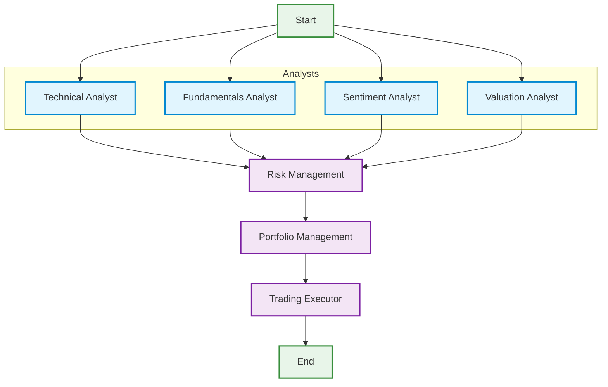

# Agentic Hedge Fund 🤖📈

An AI-powered trading system that uses multiple specialized agents to analyze stocks and make trading decisions.

## Quick Start

```bash
# Install dependencies
poetry install

# Copy example env file and edit with your settings
cp .env.example .env

# Run the trading system
poetry run python src/main.py
```

## System Architecture

The trading system uses a multi-agent workflow where each agent specializes in a different type of analysis:



## Configuration

### Environment Variables

Create a `.env` file with your configuration:

```bash
# OpenAI API Configuration
OPENAI_API_KEY=your-api-key-here
PORTFOLIO_MANAGER_MODEL=gpt-3.5-turbo-16k

# Trading Configuration
TICKERS=AAPL,MSFT,GOOGL    # Stocks to analyze
INITIAL_CASH=100000.0      # Starting capital
START_DATE=2024-01-01      # For historical analysis
END_DATE=2024-01-30
SHOW_REASONING=true        # Show detailed analysis

# Display Settings
PROGRESS_COLUMN_WIDTH=100  # For progress bars
AGENT_NAME_WIDTH=20

# Analyst Selection
# Available analysts:
# - technical_analyst_agent: Technical analysis (price patterns, indicators)
# - fundamentals_agent: Financial statements, ratios
# - sentiment_analysis_agent: News, social media sentiment
# - valuation_agent: Fair value estimation
SELECTED_ANALYSTS=technical_analyst_agent,fundamentals_agent,sentiment_analysis_agent,valuation_agent
```

### Command Line Interface

Run with specific options:

```bash
# Analyze specific tickers
poetry run python src/main.py --tickers AAPL,TSLA

# Set initial capital
poetry run python src/main.py --initial-cash 50000

# Choose specific analysts
poetry run python src/main.py --analysts technical_analyst_agent,fundamentals_agent

# Set date range
poetry run python src/main.py --start-date 2024-01-01 --end-date 2024-01-30

# Show detailed reasoning
poetry run python src/main.py --show-reasoning
```

## Example Output

```
Analysis for AAPL
=================

ANALYST SIGNALS:
┌─────────────────┬──────────┬────────────┐
│ Analyst         │  Signal  │ Confidence │
├─────────────────┼──────────┼────────────┤
│ Technical       │ BULLISH  │      85.5% │
│ Fundamentals    │ BULLISH  │      92.0% │
│ Sentiment       │ NEUTRAL  │      60.0% │
│ Valuation       │ BULLISH  │      78.5% │
└─────────────────┴──────────┴────────────┘

TRADING DECISION:
┌────────────┬──────────┐
│ Action     │      BUY │
│ Quantity   │      100 │
│ Confidence │    85.5% │
└────────────┴──────────┘

PORTFOLIO SUMMARY
┌────────┬────────┬──────────┬────────────┐
│ Ticker │ Action │ Quantity │ Confidence │
├────────┼────────┼──────────┼────────────┤
│ AAPL   │ BUY    │     100  │     85.5%  │
│ MSFT   │ HOLD   │       0  │     65.0%  │
│ GOOGL  │ SELL   │      50  │     78.5%  │
└────────┴────────┴──────────┴────────────┘
```

## Autonomous Mode

Run the system in autonomous mode to continuously monitor and trade:

```bash
# Set in .env
AUTONOMOUS_MODE=true
TRADING_INTERVAL=60         # Minutes between trades
MARKET_HOURS_ONLY=true      # Only trade during market hours
TRADING_TIMEZONE=America/New_York

# Or via command line
poetry run python src/main.py --autonomous --interval 60
```

## Docker Deployment

Run the trading system in a Docker container:

```bash
# Build the image
docker build -t agentic-agentic-hedge-fund .

# Run with environment variables
docker run -d \
  --name agentic-hedge-fund \
  --env-file .env \
  agentic-hedge-fund
```

### Dockerfile with Supervisord

```dockerfile
FROM python:3.12-slim

# Install system dependencies
RUN apt-get update && apt-get install -y \
    supervisor \
    && rm -rf /var/lib/apt/lists/*

# Install Python dependencies
COPY pyproject.toml poetry.lock ./
RUN pip install poetry && \
    poetry config virtualenvs.create false && \
    poetry install --no-dev

# Copy application code
COPY . .

# Copy Supervisor configuration
COPY docker/supervisord.conf /etc/supervisor/conf.d/

# Start Supervisor
CMD ["/usr/bin/supervisord", "-c", "/etc/supervisor/conf.d/supervisord.conf"]
```

### Managing Processes

```bash
# View process status
docker exec agentic-hedge-fund supervisorctl status

# Restart a specific process
docker exec agentic-hedge-fund supervisorctl restart trading-system

# View logs
docker exec agentic-hedge-fund supervisorctl tail -f trading-system

# Stop all processes
docker exec agentic-hedge-fund supervisorctl stop all
```

## Backtesting

Test your trading strategies using historical data:

```bash
# Basic backtest
poetry run python src/backtester.py --tickers AAPL,MSFT,GOOGL

# Specific time period
poetry run python src/backtester.py \
  --tickers AAPL,MSFT,GOOGL \
  --start-date 2024-01-01 \
  --end-date 2024-12-31

# Custom initial capital
poetry run python src/backtester.py \
  --tickers AAPL,TSLA \
  --initial-cash 500000

# Show detailed analysis
poetry run python src/backtester.py \
  --tickers AAPL,NVDA \
  --show-reasoning
```

### Configuration

Set up backtesting parameters in `.env`:

```bash
# Backtesting Configuration
INITIAL_CASH=100000.0
START_DATE=2024-01-01
END_DATE=2024-12-31
SHOW_REASONING=true
```

### Example Output

```
Backtesting Results for AAPL, MSFT, GOOGL
========================================

Portfolio Performance:
┌──────────────────┬────────────┐
│ Metric           │ Value      │
├──────────────────┼────────────┤
│ Total Return     │ 28.5%      │
│ Annualized Alpha │ 12.3%      │
│ Sharpe Ratio     │ 1.85       │
│ Max Drawdown     │ -15.2%     │
│ Win Rate         │ 62.5%      │
└──────────────────┴────────────┘

Trading Statistics:
┌────────────┬───────┬──────────┬──────────┐
│ Symbol     │ Trades│ Win Rate │ Avg. P/L │
├────────────┼───────┼──────────┼──────────┤
│ AAPL       │    24 │    65.2% │    4.2%  │
│ MSFT       │    18 │    58.3% │    3.8%  │
│ GOOGL      │    21 │    61.9% │    5.1%  │
└────────────┴───────┴──────────┴──────────┘
```

### Performance Metrics

The backtester evaluates trading performance using:

1. **Signal Analysis**
   - Analyst agreement rate
   - Signal confidence levels
   - Signal timing accuracy

2. **Position Analysis**
   - Entry/exit timing
   - Position sizing accuracy
   - Hold duration statistics

3. **Portfolio Metrics**
   - Portfolio value over time
   - Position diversification
   - Cash utilization

## Development

```bash
# Install dev dependencies
poetry install --with dev

# Run tests
poetry run pytest

# Run linter
poetry run flake8

# Format code
poetry run black .
```