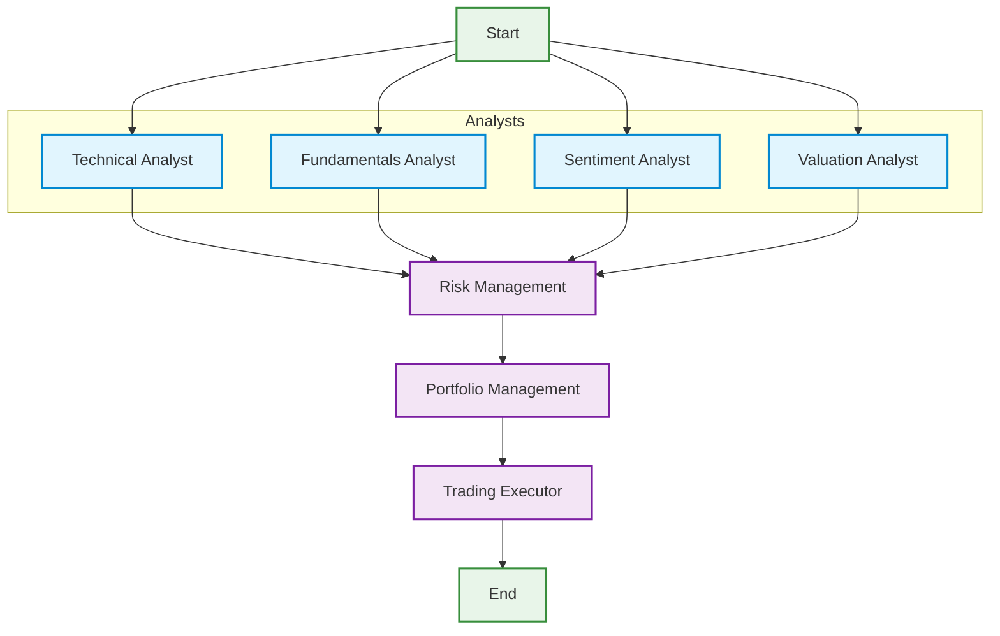

# Agentic Hedge Fund

This is a proof of concept for an AI-powered hedge fund.  The goal of this project is to explore the use of AI to make trading decisions.  This project is for **educational** purposes only and is not intended for real trading or investment.

This system employs several agents working together:

1. Technical Analyst - Analyzes price patterns, trends, and technical indicators
2. Fundamentals Analyst - Analyzes financial statements and metrics
3. Sentiment Analyst - Analyzes news and market sentiment
4. Valuation Analyst - Calculates intrinsic value using various methods
5. Risk Manager - Aggregates signals and sets position limits
6. Portfolio Manager - Makes final trading decisions using LLM reasoning
7. Trading Executor - Handles order execution and position tracking

**Important**: By default, this system runs in paper trading mode (simulated trading). While it has the capability to connect to real trading accounts through Alpaca, this is NOT RECOMMENDED. The system is designed for educational purposes and research only. Trading with real money carries significant risks and should only be done after thorough testing and with proper risk management measures in place.



## Table of Contents
- [Setup](#setup)
- [Usage](#usage)
  - [Running the Hedge Fund](#running-the-hedge-fund)
  - [Running the Backtester](#running-the-backtester)
- [Project Structure](#project-structure)
- [Contributing](#contributing)
- [Feature Requests](#feature-requests)
- [Configuration Constants](#configuration-constants)
- [License](#license)

## Setup

1. Install Poetry (if not already installed):
```bash
curl -sSL https://install.python-poetry.org | python3 -
```

2. Install dependencies:
```bash
poetry install
```

3. Configure environment:
```bash
# Create .env file from template
cp .env.example .env
```

Required environment variables:
```bash
# Get your OpenAI API key from https://platform.openai.com/
OPENAI_API_KEY=your-openai-api-key
PORTFOLIO_MANAGER_MODEL=gpt-3.5-turbo  # Optional, defaults to gpt-3.5-turbo

# Get your Financial Datasets API key from https://financialdatasets.ai/
FINANCIAL_DATASETS_API_KEY=your-financial-datasets-api-key
FINANCIAL_DATASETS_BASE_URL=https://api.financialdatasets.ai

# Alpaca Trading API Configuration (Optional)
# Get your API keys from https://app.alpaca.markets/
ALPACA_API_KEY=your-alpaca-api-key
ALPACA_API_SECRET=your-alpaca-secret-key
```

## Usage

### Running the Hedge Fund

The hedge fund can be run in three modes:

#### 1. Environment Variable Mode (Recommended)

Configure your settings in the `.env` file:
```shell
# Trading Configuration
TICKERS=AAPL,MSFT,GOOGL
START_DATE=2024-10-29  # Optional, defaults to 3 months before end date
END_DATE=2025-01-29    # Optional, defaults to today
SHOW_REASONING=true    # Optional, defaults to false

# Analyst Configuration
SELECTED_ANALYSTS=technical_analyst,fundamentals_analyst,sentiment_analyst,valuation_analyst
```

Then run without any arguments:
```bash
poetry run python src/main.py
```

This mode is ideal for:
- Automated runs
- CI/CD pipelines
- Consistent configurations
- Avoiding interactive prompts

#### 2. CLI Mode (Interactive)

Run with command line arguments to enter interactive mode:
```bash
poetry run python src/main.py --tickers AAPL,MSFT,GOOGL --initial-cash 100000 --show-reasoning
```

In CLI mode:
- If `SELECTED_ANALYSTS` is not set in `.env`, you'll get an interactive prompt to select analysts
- Other CLI arguments override their corresponding environment variables
- Provides a user-friendly way to experiment with different configurations

Available CLI arguments:
```
--tickers: Comma-separated list of stock ticker symbols
--initial-cash: Initial cash position (default: 100000.0)
--start-date: Start date in YYYY-MM-DD format
--end-date: End date in YYYY-MM-DD format
--show-reasoning: Show detailed reasoning from each analyst
```

#### 3. Autonomous Mode

Run the system continuously with scheduled trading:
```bash
# Via environment variables
AUTONOMOUS_MODE=true
TRADING_INTERVAL=60
poetry run python src/main.py

# Via command line
poetry run python src/main.py --autonomous --interval 60
```

Autonomous mode features:
- Runs continuously until stopped (Ctrl+C)
- Only trades during market hours (9:30 AM - 4:00 PM ET)
- Configurable trading interval
- Automatic market hours detection
- Error recovery and retry mechanisms

Configuration (via .env):
```bash
# Autonomous Mode Settings
AUTONOMOUS_MODE=false
TRADING_INTERVAL=60
MARKET_HOURS_ONLY=true
TRADING_TIMEZONE=America/New_York
MIN_TRADING_INTERVAL=5
MAX_TRADING_INTERVAL=240

# Safety Limits
MAX_POSITION_SIZE=25000
MAX_PORTFOLIO_VALUE=1000000
RETRY_ATTEMPTS=3
RETRY_DELAY=5
```

**Note**: When running in autonomous mode, ensure you have:
1. Sufficient API credits/quotas
2. Stable internet connection
3. Proper error handling in place
4. Monitoring system for alerts

### Running the Backtester

The backtester uses the same configuration as the main hedge fund. You can run it in two modes:

#### 1. Environment Variable Mode (Recommended)

Configure your settings in the `.env` file:
```shell
# Trading Configuration
TICKERS=AAPL,MSFT,GOOGL
START_DATE=2024-01-29  # Optional, defaults to 1 year before end date
END_DATE=2025-01-29    # Optional, defaults to today
SHOW_REASONING=true    # Optional, defaults to false
INITIAL_CASH=100000.0  # Optional, defaults to 100000.0

# Analyst Configuration
SELECTED_ANALYSTS=technical_analyst,fundamentals_analyst,sentiment_analyst,valuation_analyst
```

Then run:
```bash
poetry run python src/backtester.py
```

#### 2. CLI Mode (Interactive)

Run with command line arguments to enter interactive mode:
```bash
poetry run python src/backtester.py --tickers AAPL,MSFT,GOOGL --initial-capital 100000 --show-reasoning
```

Available CLI arguments:
```
--tickers: Comma-separated list of stock ticker symbols
--initial-capital: Initial capital amount (default: 100000.0)
--start-date: Start date in YYYY-MM-DD format (default: 1 year ago)
--end-date: End date in YYYY-MM-DD format (default: today)
--show-reasoning: Show detailed reasoning from each analyst
```

The backtester will:
1. Run the hedge fund strategy day by day over the specified period
2. Plot the portfolio value over time
3. Calculate and display key metrics:
   - Total Return
   - Sharpe Ratio
   - Maximum Drawdown

Note: The backtester uses the same analyst configuration as the main hedge fund. If no analysts are specified in the environment or selected interactively, it will use all available analysts.

**Example Output:**


You can optionally specify the start and end dates to backtest over a specific time period.

```bash
poetry run python src/backtester.py --ticker AAPL,MSFT,NVDA --start-date 2024-01-01 --end-date 2024-03-01
```

## Features

### Core Components

1. **Analyst Agents** - Run in parallel to analyze different aspects:
   - Technical Analyst: Price patterns and indicators
   - Fundamentals Analyst: Financial metrics and ratios
   - Sentiment Analyst: News and market sentiment
   - Valuation Analyst: Intrinsic value calculations

2. **Risk Management** - Aggregates analyst signals and:
   - Calculates position limits
   - Assesses portfolio risk
   - Sets trading constraints

3. **Portfolio Management** - Makes final decisions using:
   - GPT-3.5/4 for reasoning
   - Risk metrics
   - Analyst signals
   - Current positions

4. **Trading Executor** - Handles order execution:
   - Paper trading support
   - Order validation
   - Position tracking
   - Error handling

### Key Features

- **Parallel Analysis**: Multiple analysts run concurrently for efficiency
- **Sequential Decision Making**: Risk → Portfolio → Trading for safety
- **Flexible Configuration**: Use environment variables or CLI
- **Error Handling**: Graceful degradation on API failures
- **Progress Tracking**: Real-time status updates for each component
- **Paper Trading**: Safe simulation without real money

## Data Connectors

The project uses a flexible data connector abstraction to fetch market data. This architecture allows for easy switching between different data providers and simplifies testing.

### Architecture

The data connector system consists of:

- **Base Connector Interface** (`DataConnector`): Abstract base class defining the interface for all data connectors
- **Financial Datasets Connector** (`FinancialDatasetsConnector`): Default implementation using api.financialdatasets.ai
- **Seeking Alpha Connector** (`SeekingAlphaConnector`): Implementation using seekingalpha.com
- **Connector Factory**: Manages connector instances and provides a global access point

```python
from data.connectors import DataConnector, get_connector, set_connector

# Get the default connector
connector = get_connector()

# Use the connector
prices = connector.get_prices("AAPL", "2024-01-01", "2024-01-31")
```

### Available Methods

All data connectors provide these methods:

```python
def get_prices(ticker: str, start_date: str, end_date: str) -> List[Price]:
    """Get historical price data for a ticker."""

def get_financial_metrics(ticker: str, end_date: str, period: str = "ttm") -> List[FinancialMetrics]:
    """Get financial metrics for a ticker."""

def search_line_items(ticker: str, line_items: List[str], end_date: str) -> List[LineItem]:
    """Search for specific line items in financial statements."""

def get_insider_trades(ticker: str, end_date: str, start_date: Optional[str] = None) -> List[InsiderTrade]:
    """Get insider trading data for a ticker."""

def get_company_news(ticker: str, end_date: str, start_date: Optional[str] = None) -> List[CompanyNews]:
    """Get company news articles."""

def get_market_cap(ticker: str, end_date: str) -> float:
    """Get market capitalization for a ticker."""
```

### Implementing a Custom Connector

To add a new data source:

1. Create a new class implementing the `DataConnector` interface:
```python
from data.connectors import DataConnector

class YourCustomConnector(DataConnector):
    def get_prices(self, ticker: str, start_date: str, end_date: str) -> List[Price]:
        # Your implementation here
        pass
    # Implement other required methods...
```

2. Set it as the active connector:
```python
from data.connectors import set_connector

set_connector(YourCustomConnector())
```

### Built-in Features

- **Caching**: The default Financial Datasets connector includes caching to reduce API calls
- **Error Handling**: Consistent error handling across all connectors
- **Type Safety**: All data models use Pydantic for validation
- **Pagination**: Built-in support for paginated API responses

### Testing

The connector abstraction makes it easy to mock data sources for testing:

```python
from data.connectors import DataConnector, set_connector

class MockDataConnector(DataConnector):
    def get_prices(self, ticker: str, start_date: str, end_date: str) -> List[Price]:
        return [Price(time="2024-01-01T00:00:00Z", open=100.0, close=101.0, ...)]

# Use mock connector in tests
set_connector(MockDataConnector())
```

## Docker Deployment

The project can be run using Docker for easy deployment in any environment.

### Using Docker Compose (Recommended)

1. Make sure you have Docker and Docker Compose installed on your system.

2. Set up your environment variables:
```bash
cp .env.example .env
# Edit .env with your API keys
```

3. Build and run the container:
```bash
docker-compose up --build
```

This will run the hedge fund with default tickers (AAPL, MSFT, NVDA). To use different tickers or options:

```bash
docker-compose run hedge-fund --ticker TSLA,GOOGL --show-reasoning
```

### Using Docker Directly

1. Build the Docker image:
```bash
docker build -t ai-hedge-fund .
```

2. Run the container:
```bash
docker run --env-file .env ai-hedge-fund --ticker AAPL,MSFT,NVDA
```

### Cloud Deployment

To deploy in cloud environments:

1. Push the image to a container registry (e.g., Docker Hub, AWS ECR, Google Container Registry)
2. Deploy using your cloud provider's container service (e.g., AWS ECS, Google Cloud Run, Azure Container Instances)
3. Make sure to set the environment variables in your cloud provider's configuration

Example for AWS ECR:
```bash
# Login to ECR
aws ecr get-login-password --region region | docker login --username AWS --password-stdin aws_account_id.dkr.ecr.region.amazonaws.com

# Tag the image
docker tag ai-hedge-fund:latest aws_account_id.dkr.ecr.region.amazonaws.com/ai-hedge-fund:latest

# Push the image
docker push aws_account_id.dkr.ecr.region.amazonaws.com/ai-hedge-fund:latest
```

## Configuration Constants

The following are important configuration constants used throughout the project:

### Portfolio Management
- `INITIAL_CASH`: Default initial cash position is $100,000.00
- `BACKTEST_PERIOD`: Default backtest period is 1 year from end date
- `LOOKBACK_PERIOD`: Default lookback period is 3 months when no start date is specified

### Data Fetching
- `FINANCIAL_METRICS_LIMIT`: 10 periods of financial metrics are fetched
- `INSIDER_TRADES_LIMIT`: 1000 insider trades are fetched per period
- `NEWS_LIMIT`: 1000 news items are fetched per period
- `BALANCE_SHEET_LIMIT`: 2 periods (current and previous) for working capital calculation

### Display Settings
- `PROGRESS_REFRESH_RATE`: 4 updates per second for progress display
- `PROGRESS_COLUMN_WIDTH`: 100 characters for progress display column
- `AGENT_NAME_WIDTH`: 20 characters for agent name display

## Disclaimer

This project is for **educational and research purposes only**.

- Not intended for real trading or investment
- No warranties or guarantees provided
- Past performance does not indicate future results
- Creator assumes no liability for financial losses
- Consult a financial advisor for investment decisions

By using this software, you agree to use it solely for learning purposes.